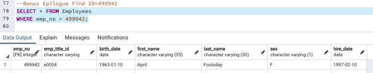

# SQL Database Management Project

#### Data Modeling

I inspected the CSV files that I obtained for the project, and sketched out an Entity Relationship Diagram (ERD). I used a tool: [http://www.quickdatabasediagrams.com](http://www.quickdatabasediagrams.com), to create the diagram.

* ERD Image

#### Data Engineering

* I created a table schema for each of the six CSV files with specifying data types, primary keys, foreign keys, and other constraints.

* Imported each CSV file into the corresponding SQL table using postgreSQL.

#### Data Analysis with Query

1. I listed the following details of each employee: employee number, last name, first name, sex, and salary.

2. I iisted first name, last name, and hire date for employees who were hired in 1986.

3. I listed the manager of each department with the following information: department number, department name, the manager's employee number, last name, first name.

4. I listed the department of each employee with the following information: employee number, last name, first name, and department name.

5. I listed first name, last name, and sex for employees whose first name is "Hercules" and last names begin with "B."

6. I listed all employees in the Sales department, including their employee number, last name, first name, and department name.

7. I listed all employees in the Sales and Development departments, including their employee number, last name, first name, and department name.

8. In descending order, I listed the frequency count of employee last names, i.e., how many employees share each last name.

## Extra

1. I imported the SQL database into Python-Pandas.

2. I created a histogram to visualize the most common salary ranges for the employees.

* Histogram Image

3. I created a bar chart of the average salary by job titles.

* Bar Chart Image

## Epilogue

Searched ID number: 499942.

* ID 499942 Information

Enjoy!
